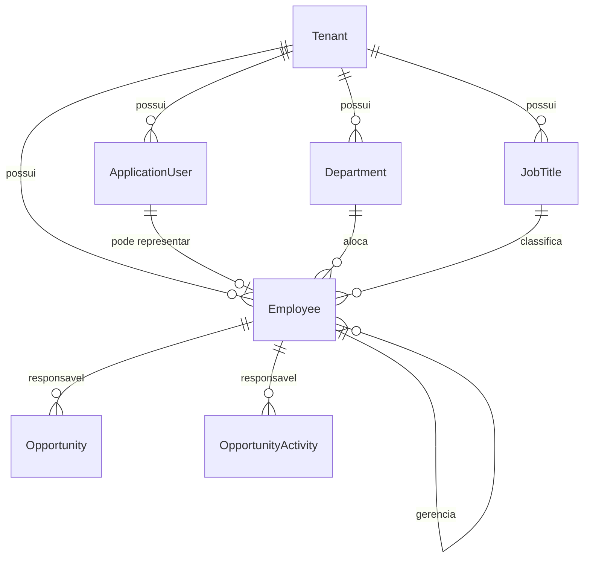

# Organizacao, Pessoas e Responsaveis

Este documento planeja a base organizacional para relacionar usuarios do sistema com funcionarios, cargos, departamentos, hierarquias e responsaveis de negocio.

## Objetivo

Criar um modelo reutilizavel pelo Core, CRM, Financeiro e demais modulos para responder perguntas como:

- Qual usuario representa qual funcionario?
- Qual funcionario e responsavel por uma oportunidade ou atividade?
- Qual e o cargo, departamento e gestor desse funcionario?
- Quem pode visualizar carteira, agenda e resultados de uma equipe?
- Como manter dados de pessoa/funcionario separados de credenciais e acesso?

## Premissas

- `ApplicationUser` continua sendo a identidade de acesso: login, senha, roles, permissoes e claims.
- `Employee` representa a pessoa funcional dentro do tenant.
- Um usuario pode estar vinculado a zero ou um funcionario ativo por tenant.
- Um funcionario pode existir sem usuario, por exemplo vendedores externos, funcionarios ainda sem acesso ou historico importado.
- O vinculo usuario-funcionario deve ser opcional, mas unico quando existir.
- Cargos, departamentos e hierarquias sao dados de negocio do tenant e devem ser persistidos em banco.
- Valores fechados devem usar enums valorados ou constantes centralizadas.
- Nada de cargo, hierarquia, regra de visibilidade ou responsavel hardcoded.

## Modelo Conceitual



## Entidades Planejadas

### Department

Representa uma area organizacional do tenant.

Campos planejados:

- `Id`
- `TenantId`
- `Name`
- `Code`
- `IsActive`
- `CreatedAt`
- `UpdatedAt`

Regras:

- `Code` unico por tenant.
- `Name` obrigatorio.
- Desativacao logica para preservar historico.

Status de implementacao: `Done` na UE-13.01.

### JobTitle

Representa cargo ou funcao.

Campos planejados:

- `Id`
- `TenantId`
- `Name`
- `Code`
- `Level`
- `IsLeadership`
- `IsActive`
- `CreatedAt`
- `UpdatedAt`

Regras:

- `Code` unico por tenant.
- `Level` deve ser valor positivo e ajuda ordenacao de senioridade.
- `IsLeadership` indica cargos que podem atuar como gestores em fluxos de negocio.

Status de implementacao: `Done` na UE-13.01.

### Employee

Representa o funcionario ou colaborador de negocio.

Campos planejados:

- `Id`
- `TenantId`
- `ApplicationUserId`
- `DepartmentId`
- `JobTitleId`
- `ManagerEmployeeId`
- `FullName`
- `Document`
- `CorporateEmail`
- `Phone`
- `HireDate`
- `TerminationDate`
- `Status`
- `CreatedAt`
- `UpdatedAt`

Valores fechados:

- `EmployeeStatus`: `Active = 1`, `Inactive = 2`, `OnLeave = 3`, `Terminated = 4`.

Regras:

- `ApplicationUserId` opcional e unico por tenant quando informado.
- `CorporateEmail` unico por tenant quando informado.
- `ManagerEmployeeId` deve apontar para funcionario do mesmo tenant.
- Funcionario nao pode ser seu proprio gestor.
- `TerminationDate` deve mudar status para `Terminated`.
- Desativar usuario nao deve apagar funcionario nem historico.

Status de implementacao: `Done` na UE-13.01.

Migration: `AddOrganizationEntities`.

## Relacao Usuario x Funcionario

`ApplicationUser` e uma credencial. `Employee` e uma pessoa funcional.

Exemplos:

- Admin tecnico pode ter usuario sem funcionario.
- Vendedor interno deve ter usuario vinculado a funcionario.
- Representante externo pode ter funcionario sem usuario.
- Um funcionario desligado preserva historico, mas pode ter usuario desativado.

Essa separacao evita misturar autenticacao com estrutura organizacional.

## Hierarquia

A hierarquia inicial sera baseada em `Employee.ManagerEmployeeId`.

Regras planejadas:

- Um funcionario pode ter zero ou um gestor direto.
- A arvore deve ser sempre do mesmo tenant.
- Ciclos devem ser bloqueados.
- Consultas futuras podem retornar subordinados diretos e arvore completa.

Para o MVP, a hierarquia sera simples. Estruturas mais complexas, como multiplas alocacoes ou matriz, ficam fora do primeiro bloco.

## Responsaveis Comerciais

Depois da base organizacional, o CRM deve receber:

### Opportunity.OwnerEmployeeId

Responsavel principal pela oportunidade.

Regras:

- Deve apontar para `Employee` ativo do mesmo tenant.
- Pode ser obrigatorio depois que a oportunidade sair da etapa inicial, mas opcional na criacao inicial.
- Troca de responsavel deve registrar `OpportunityHistoryEntry`.

Status de implementacao: `Done` na UE-13.04.

## Visoes Gerenciais Planejadas

As visoes gerenciais por responsavel devem alimentar dashboards e telas web sem exigir que o frontend calcule regra de negocio.

Endpoints planejados:

- `GET /api/crm/responsibles/portfolio-summary`
- `GET /api/crm/responsibles/opportunities-summary`
- `GET /api/crm/responsibles/overdue-activities-summary`
- `GET /api/crm/responsibles/upcoming-activities-summary`
- `GET /api/crm/teams/funnel-summary`

Escopo da UE-13.05:

- Agrupar oportunidades por `OwnerEmployeeId`.
- Calcular quantidade e valor estimado de oportunidades abertas por responsavel.
- Agrupar atividades vencidas por `OwnerEmployeeId`.
- Agrupar proximas atividades por `OwnerEmployeeId`.
- Permitir funil por departamento/equipe usando `Employee.DepartmentId`.
- Retornar dados prontos para dashboard comercial.

Status de implementacao: planejado para UE-13.05.

### OpportunityActivity.OwnerEmployeeId

Responsavel por executar a atividade.

Regras:

- Deve apontar para `Employee` ativo do mesmo tenant.
- Atividades vencidas/proximas poderao ser filtradas por responsavel.
- Conclusao/cancelamento deve preservar o responsavel historico.

Status de implementacao: `Done` na UE-13.04.

## Endpoints Planejados

### Departamentos

- `GET /api/departments`
- `GET /api/departments/{departmentId}`
- `POST /api/departments`
- `PUT /api/departments/{departmentId}`
- `DELETE /api/departments/{departmentId}`

Status de implementacao: `Done` na UE-13.02.

### Cargos

- `GET /api/job-titles`
- `GET /api/job-titles/{jobTitleId}`
- `POST /api/job-titles`
- `PUT /api/job-titles/{jobTitleId}`
- `DELETE /api/job-titles/{jobTitleId}`

Status de implementacao: `Done` na UE-13.02.

### Funcionarios

- `GET /api/employees`
- `GET /api/employees/{employeeId}`
- `POST /api/employees`
- `PUT /api/employees/{employeeId}`
- `DELETE /api/employees/{employeeId}`
- `POST /api/employees/{employeeId}/link-user`
- `POST /api/employees/{employeeId}/unlink-user`
- `GET /api/employees/{employeeId}/subordinates`

Status de implementacao:

- CRUD e subordinados diretos: `Done` na UE-13.02.
- `link-user` e `unlink-user`: `Done` na UE-13.03.

Request de vinculo usuario-funcionario:

```json
{
  "applicationUserId": "00000000-0000-0000-0000-000000000000"
}
```

`GET /api/me` retorna o campo `employee` preenchido quando o usuario autenticado possui funcionario vinculado.

### CRM com responsaveis

- `PUT /api/opportunities/{opportunityId}/owner`
- `PUT /api/opportunity-activities/{activityId}/owner`
- `GET /api/customers/{customerId}/opportunities?ownerEmployeeId={employeeId}`
- `GET /api/opportunity-stages/{stageId}/opportunities?ownerEmployeeId={employeeId}`
- `GET /api/opportunity-activities/overdue?ownerEmployeeId={employeeId}`
- `GET /api/opportunity-activities/upcoming?ownerEmployeeId={employeeId}&days=7`

## Permissoes Planejadas

Permissoes Core:

- `core.departments.view`
- `core.departments.manage`
- `core.job-titles.view`
- `core.job-titles.manage`
- `core.employees.view`
- `core.employees.manage`
- `core.hierarchy.view`
- `core.hierarchy.manage`

Permissoes CRM ja existentes continuam controlando oportunidades e atividades.

## Ordem Recomendada de Implementacao

1. Criar entidades `Department`, `JobTitle`, `Employee` e enum `EmployeeStatus`.
2. Criar configuracoes EF, indices e migration.
3. Criar portas, commands/queries, handlers e repositorios.
4. Expor endpoints Core para departamentos, cargos e funcionarios.
5. Criar vinculo usuario-funcionario.
6. Adicionar `OwnerEmployeeId` em `Opportunity` e `OpportunityActivity`.
7. Atualizar queries operacionais do CRM com filtro por responsavel.
8. Registrar historico quando responsavel de oportunidade ou atividade mudar.

## Fora do Primeiro Bloco

- Multiplos vinculos simultaneos de funcionario com departamentos.
- Estrutura matricial com mais de um gestor.
- Folha de pagamento.
- Controle de ponto.
- Avaliacao de desempenho.
- Alocacao por centro de custo.
- Permissoes automaticas derivadas da hierarquia.

Esses itens podem virar epicos futuros se fizerem sentido para o ERP.
